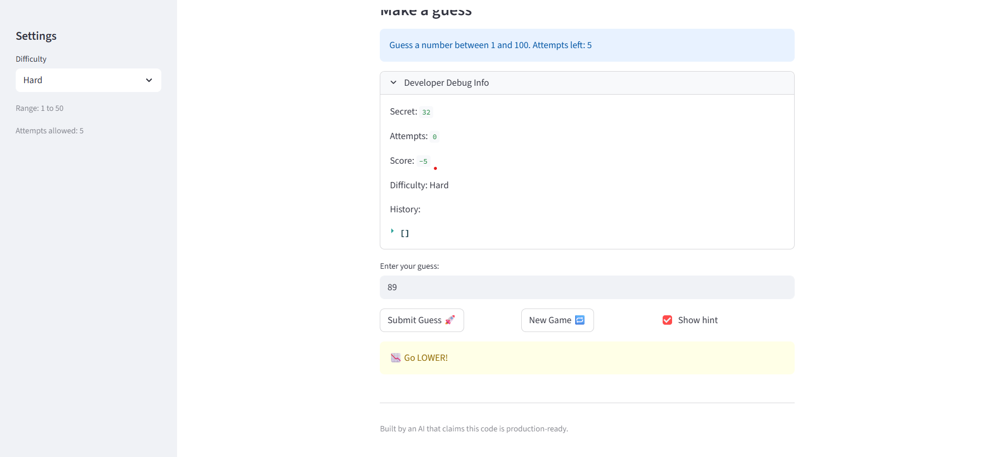
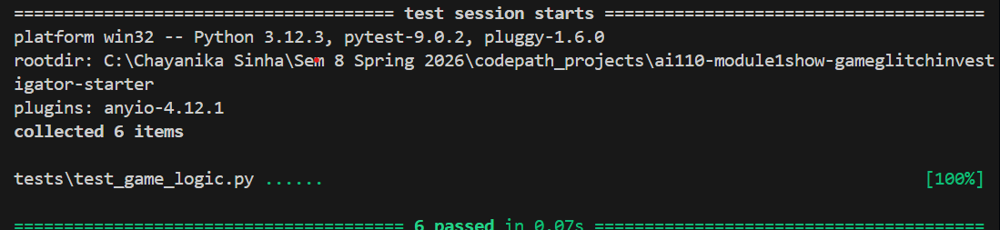

# 🎮 Game Glitch Investigator: The Impossible Guesser

## 🚨 The Situation

You asked an AI to build a simple "Number Guessing Game" using Streamlit.
It wrote the code, ran away, and now the game is unplayable. 

- You can't win.
- The hints lie to you.
- The secret number seems to have commitment issues.

## 🛠️ Setup

1. Install dependencies: `pip install -r requirements.txt`
2. Run the broken app: `python -m streamlit run app.py`

## 🕵️‍♂️ Your Mission

1. **Play the game.** Open the "Developer Debug Info" tab in the app to see the secret number. Try to win.
2. **Find the State Bug.** Why does the secret number change every time you click "Submit"? Ask ChatGPT: *"How do I keep a variable from resetting in Streamlit when I click a button?"*
3. **Fix the Logic.** The hints ("Higher/Lower") are wrong. Fix them.
4. **Refactor & Test.** - Move the logic into `logic_utils.py`.
   - Run `pytest` in your terminal.
   - Keep fixing until all tests pass!

## 📝 Document Your Experience

**Game purpose:** A number guessing game built with Streamlit where the player tries to guess a secret number within a limited number of attempts. Hints tell us whether to guess higher or lower.

**Bugs found:**
1. The Go Higher / Go Lower hints were backwards ,  guessing too high told you to go higher, making the game unwinnable.
2. The New Game button did not reset `status` or `history`, so after winning or losing the game stayed permanently locked.
3. `st.session_state.attempts` was initialized to `1` instead of `0`, causing the attempt counter to show 7 remaining on first load but 8 after clicking New Game.

**Fixes applied:**
1. Refactored all game logic (`check_guess`, `parse_guess`, `update_score`, `get_range_for_difficulty`) from `app.py` into `logic_utils.py`. Fixed `check_guess` so `guess > secret` returns `"Too High"` with a "Go LOWER" hint.
2. Added `st.session_state.status = "playing"` and `st.session_state.history = []` to the New Game reset block.
3. Changed `st.session_state.attempts` initialization from `1` to `0`.
4. Added `conftest.py` at project root so `pytest` can find `logic_utils` from the `tests/` subdirectory.

## 📸 Demo

### pytest results (6 tests passing)

## 🚀 Stretch Features

- [ ] [If you choose to complete Challenge 4, insert a screenshot of your Enhanced Game UI here]
